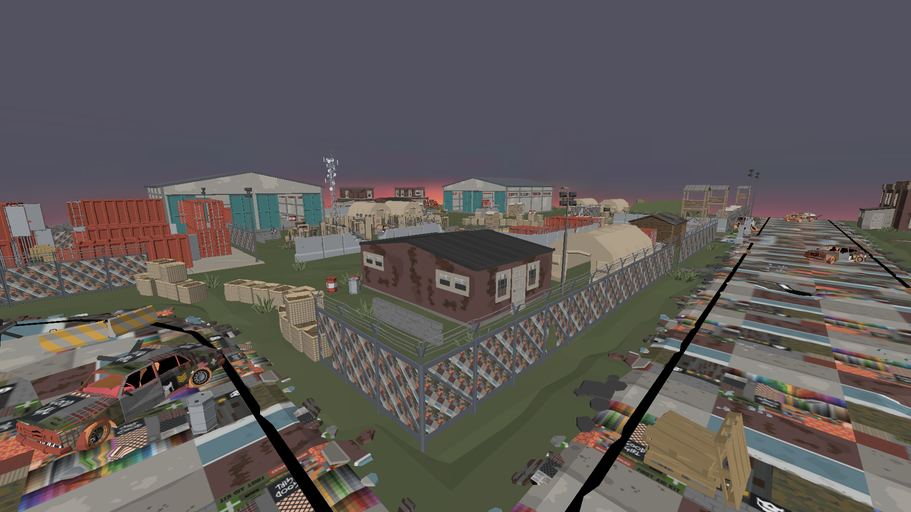

# garden in OpenGL 1.3

Little project I developed over the course of one week to learn more about OpenGL and sit down to write C++. You can watch the [youtube video here](https://www.youtube.com/watch?v=Tgh8cL2mYEY&t).

## how the project is organized
The project grew as wildly as an unmanaged garden. Everything is a header file, since linking in Dev-C++ was a pain in the butt.
|script| function |
|--|--|
| playerEntity.hpp | class that manages the player by handling the input through a callback, updating the player position and camera. |
| gameObject.hpp | unity knockoff entity. it's basically an object class in the gameworld, with position rotation and so on. components can be attached to gameObjects.
| mesh.hpp | first component I've made. attaches to a gameObject and keeps track of mesh data to be rendered.
| rigidbody.hpp | physics component. whenever attached to a gameObject that gameObject will receive physics (just gravity for now).
| world.hpp | generic world class. it's meant to be static but I guess there aren't statics in C++. **handles collisions and keeps track off all entities**.
| camera.hpp | simple camera class with some utility functions. it's managed by the player.

## how did I do collision handling?
Since I was *very short on time*, I didn't think it was possible to materially comprehend SAT and implement it (I didn't want the easy route with AABB).
I came up with the escamotage of handling solely the player, since it would've been the only moving thing in the demo anyways.

The player is a sphere and it's checked with each mesh in the scene for collisions. There are some optimizations in place to avoid unnecessary computations. The algorithm does the following:

 1. Loop through each mesh in the scene
 2. Loop through each triangle in the mesh
 3. Is the triangle face pointing towards the face? (eligible for collision? if not break)
 4. Project the player position on the triangle's plane
 5. Is the projected point within the triangle's region? (barycentric coordinates. if not break)
 6. Check distance from triangle's center to player
 7. If the distance is less than the radius of the player's sphere collider resolve by simply adding an offset along the face's normal

It's basically "Collide and Slide". The "projected point" part has obviously some issues, and some collisions will go undetected and result snappy when the sphere's center eventually projects. I solved this with some lazy interpolation.
